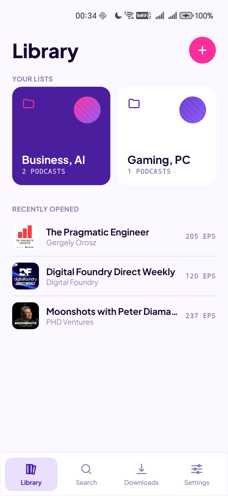
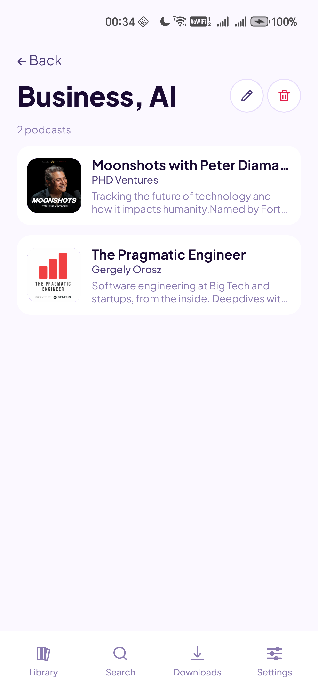

# Kofipod

A personal podcasting app for Android (Kotlin Multiplatform, iOS to follow).

## Screenshots

<p align="left">
  
  
  
</p>

## Setup

1. Register a Podcast Index account at https://api.podcastindex.org/ and obtain an API key and secret.
2. Copy `local.properties.template` to `local.properties` and fill in:

   ```
   PODCAST_INDEX_KEY=your-key
   PODCAST_INDEX_SECRET=your-secret
   ```

   CI builds can provide the same values via environment variables.

3. For release builds, copy `keystore.properties.template` to `keystore.properties` and place your release keystore at `keystore/release.jks`.

4. Build: `./gradlew :composeApp:assembleDebug`

User data (library + playback state) backs up transparently via Android Auto Backup to the user's Google account — no in-app sign-in, no OAuth client. See `composeApp/src/androidMain/res/xml/backup_rules.xml`.

## Release

Versioning is driven by `version.properties` at the repo root (`VERSION_NAME` + `VERSION_CODE`). The release artifact is signed with a keystore that lives outside version control.

### One-time keystore setup

```
mkdir -p keystore
keytool -genkey -v -keystore keystore/release.jks \
    -keyalg RSA -keysize 2048 -validity 10000 -alias kofipod
cp keystore.properties.template keystore.properties
# then fill in storePassword, keyAlias, keyPassword in keystore.properties
```

`keystore/`, `*.jks`, and `keystore.properties` are gitignored.

### Cutting a release

```
./scripts/release.sh patch   # or: minor | major
```

The script:

1. Aborts if the working tree is dirty (override with `--no-git`).
2. Verifies the keystore is present.
3. Bumps `version.properties` (`VERSION_CODE` +1, `VERSION_NAME` per semver field).
4. Builds a signed APK + AAB.
5. Copies them into `dist/` as `kofipod-<VERSION_NAME>-<VERSION_CODE>-release.{apk,aab}` and prints SHA-256s.
6. Commits `version.properties` and tags `v<VERSION_NAME>` locally. Push with `git push && git push --tags`.

R8/minification is intentionally off for the release build until per-library keep rules are written.

## License

GPL-3.0-or-later. See [LICENSE](LICENSE).
