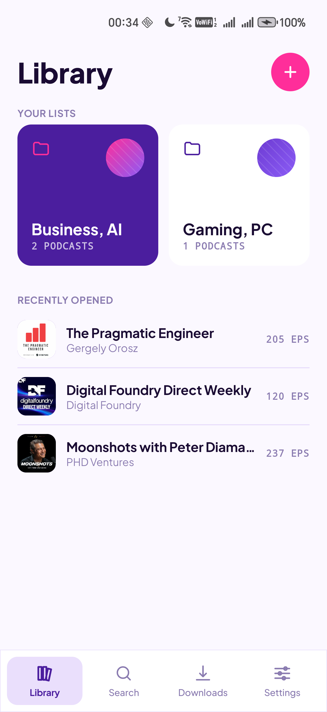

# Kofipod

A personal podcasting player app for Android (Kotlin Multiplatform, iOS to follow). 

If you're just here to download the app, it's in the [releases section](https://github.com/kofikodr/kofipod/releases). 

## Screenshots

<p align="left">
  
  
  
</p>

## Android Auto

Kofipod supports Android Auto — your library, folders, and recent episodes show up in the car's media picker, and playback controls work from the head unit.

If you installed Kofipod from the [releases page](https://github.com/kofikodr/kofipod/releases) (i.e. sideloaded), Android Auto will hide it by default. Production head units only show media apps installed from the Play Store unless you opt in to unknown sources. (The Desktop Head Unit emulator skips this check, which is why testing there always works.)

To enable it:

1. Open Android Auto settings on your phone. On newer phones (e.g. recent Pixel / Android 14+) Android Auto is no longer a standalone app — open **Settings** and search for **Android Auto**, or go to **Settings → Connected devices → Android Auto**. On older phones, open the **Android Auto** app from the launcher.
2. Scroll to the bottom and tap the **Version** line about 10 times until a "Allow development settings" toast appears.
3. Tap the ⋮ overflow menu → **Developer settings**.
4. Enable **Unknown sources**.
5. Force-stop Android Auto and reconnect to the car. Kofipod should now appear in the media app picker.

After an Android Auto update the developer toggle occasionally resets — re-enable if Kofipod disappears later.

## Development Setup

1. Register a Podcast Index account at https://api.podcastindex.org/ and obtain an API key and secret.
2. Copy `local.properties.template` to `local.properties` and fill in:

   ```
   PODCAST_INDEX_KEY=your-key
   PODCAST_INDEX_SECRET=your-secret
   ```

   CI builds can provide the same values via environment variables.

3. For release builds, copy `keystore.properties.template` to `keystore.properties` and place your release keystore at `keystore/release.jks`.

4. Build: `./gradlew :composeApp:assembleDebug`

User data (library + playback state) backs up transparently via Android Auto Backup to the user's Google account — no in-app sign-in, no OAuth client. See `composeApp/src/androidMain/res/xml/backup_rules.xml`.

### Diagnostics (optional)

Kofipod has opt-in crash reporting (GlitchTip, Sentry-protocol-compatible, MIT-licensed) and opt-in usage telemetry (Aptabase). Both are off until the user acknowledges a first-launch disclosure, both can be toggled independently in Settings, and both are no-ops when the build secrets are blank — forks and F-Droid builds work fine without configuring anything. Detail: `docs/superpowers/specs/2026-05-05-diagnostics-design.md`.

To enable for your own build, add to `local.properties`:

```
SENTRY_DSN=https://<public_key>@<glitchtip-host>/<project_id>
APTABASE_APP_KEY=A-EU-XXXXXXXXXX   # or A-US-...
```

The maintainer's GlitchTip instance is self-hosted on Railway via the official one-click template; an Aptabase free tier account (EU region) covers the usage side. Maintainer-facing hosting runbook: `docs/diagnostics-hosting.md`. User-facing privacy policy: [`PRIVACY.md`](PRIVACY.md).

## Release

Versioning is driven by `version.properties` at the repo root (`VERSION_NAME` + `VERSION_CODE`). The release artifact is signed with a keystore that lives outside version control.

### One-time keystore setup

```
mkdir -p keystore
keytool -genkey -v -keystore keystore/release.jks \
    -keyalg RSA -keysize 2048 -validity 10000 -alias kofipod
cp keystore.properties.template keystore.properties
# then fill in storePassword, keyAlias, keyPassword in keystore.properties
```

`keystore/`, `*.jks`, and `keystore.properties` are gitignored.

### Cutting a release

```
./scripts/release.sh patch   # or: minor | major
```

The script:

1. Aborts if the working tree is dirty (override with `--no-git`).
2. Verifies the keystore is present.
3. Bumps `version.properties` (`VERSION_CODE` +1, `VERSION_NAME` per semver field).
4. Builds a signed APK + AAB.
5. Copies them into `dist/` as `kofipod-<VERSION_NAME>-<VERSION_CODE>-release.{apk,aab}` and prints SHA-256s.
6. Commits `version.properties` and tags `v<VERSION_NAME>` locally. Push with `git push && git push --tags`.

R8/minification is intentionally off for the release build until per-library keep rules are written. The Sentry Gradle plugin is wired in and embeds a release UUID into each APK, but the actual mapping-upload step is a no-op while minify is off — stack traces are already readable. When R8 is turned on, set `SENTRY_AUTH_TOKEN` in `local.properties` (scopes `project:releases` + `project:write` in GlitchTip → Settings → Auth Tokens) and the release script will upload mapping files automatically. Org and project slugs default to the maintainer's GlitchTip instance; forks override via `SENTRY_ORG` / `SENTRY_PROJECT` in `local.properties` or env.

## License

GPL-3.0-or-later. See [LICENSE](LICENSE).
